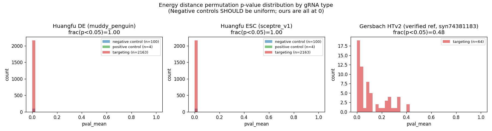
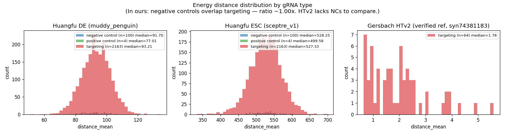
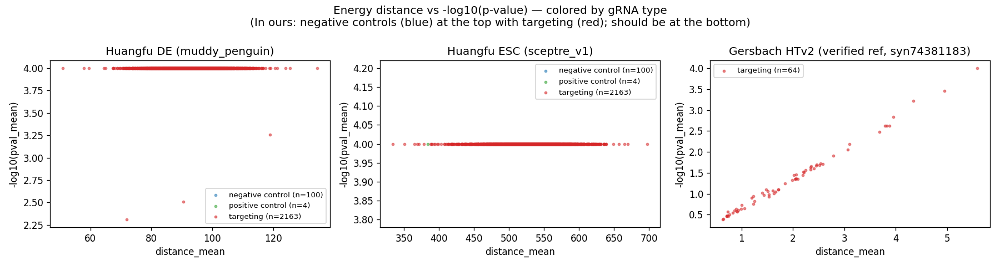
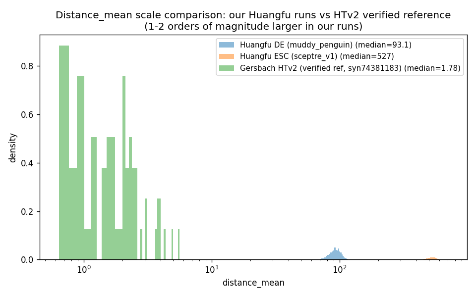

# Issue 1 — Energy-distance p-value calibration on production scale

**Status**: ⚠ both Huangfu runs complete on Synapse, but p-values are anti-conservative. The raw `distance_mean` column is still useful as an effect-size proxy. Decision needed on the recommended preprocessing fix before re-running.

**Owner of fix**: us (re-run on HPC with HVG-subset PCA in `scripts/preprocess_mudata_local.py`) ± Chikara Takeuchi (upstream guidance on whether HVG subset, matched backgrounds, or another knob is the right calibration lever at production scale).

## TL;DR

We ran the energy-distance pipeline on Huangfu DE + Huangfu ESC. Both runs completed cleanly and structurally validate against the Hon-lab HTv2 reference (4-layer validator passes). But:

- **All 100 negative controls in each run get `pval_mean = 0`** despite their distance distribution overlapping the targeting distribution.
- **NC `distance_mean` median ≈ targeting `distance_mean` median** in both runs (1.02× DE, 1.00× ESC) — i.e. the negative controls are indistinguishable from real perturbations by raw effect size, but the permutation null calls them all "extreme."
- **Distances are 1–2 orders of magnitude larger than the HTv2 reference** (HTv2 median 1.78 → our DE median 93, ESC median 527).

The pipeline's permutation null appears too tight at our distance scale. We need to either re-preprocess with a tighter feature space (HVG subset for PCA), turn on `use_matched_bg=true`, or both — but we want to confirm the recommended fix before burning another ~10 GPU-hours per dataset re-running.

## The runs

Both runs use `Chikara-Takeuchi/energy_dist_pipeline` @ main HEAD `5821450a1eacfddb3c83be8c69fd593eaf76a61c` (post the recent GPU-OOM + sgRNA-downsampling fixes), wrapped via [`scripts/run_energy_distance_pipeline.sh`](../../../../scripts/run_energy_distance_pipeline.sh) and the dataset-level [`5_run_energy_distance.sh`](../../../../datasets/Huangfu_HUES8-definitive-endoderm-differentiation_TF-Perturb-seq/5_run_energy_distance.sh).

| Run | Dataset | MuData | SLURM | Wall time | Synapse |
|---|---|---|---|---|---|
| Huangfu DE | `Huangfu_HUES8-definitive-endoderm-differentiation_TF-Perturb-seq` | `muddy_penguin` (~7 GB, 270k cells × 14k gRNAs) | 10547114 | 9h 34m | [`syn74883327`](https://www.synapse.org/Synapse:syn74883327) |
| Huangfu ESC | `Huangfu_HUES8-embryonic-stemcell-differentiation_TF-Perturb-seq` | `sceptre_v1` (~7 GB, similar scale) | 10547705 | 10h 0m | [`syn74883475`](https://www.synapse.org/Synapse:syn74883475) |
| HTv2 reference | `Gersbach_WTC11-benchmark_TF-Perturb-seq_HTv2` (verified comparison) | (Hon-lab benchmark) | — | — | [`syn74381167`](https://www.synapse.org/Synapse:syn74381167) (run); [`syn74381183`](https://www.synapse.org/Synapse:syn74381183) (`pval_edist_full.csv`) |

## Evidence

Numbers from each run's `pval_edist_full.csv` (schema in [`schemas/energy_distance.json`](../schemas/energy_distance.json), columns described in [`docs/analysis/ENERGY_DISTANCE_OUTPUTS.md`](../../../analysis/ENERGY_DISTANCE_OUTPUTS.md)):

| Run | Targets | Cells/target (median) | Targeting `distance_mean` median | NC `distance_mean` median | NC vs targeting ratio | NC count with `pval_mean=0` | Targeting > NC max |
|---|---:|---:|---:|---:|---:|---:|---:|
| HTv2 reference | 64 | 2000 | **1.78** | _no NCs in run_ | — | _n/a_ | _n/a_ |
| Huangfu DE | 2267 | 2000 | **93.21** | 91.70 | **1.02×** | **100 / 100** | **69 / 2163** (3.2%) |
| Huangfu ESC | 2267 | 2000 | **527.33** | 528.25 | **1.00×** | **100 / 100** | **83 / 2163** (3.8%) |

> "Targeting > NC max" is the calibration-robust significance proxy: count of targeting rows whose `distance_mean` exceeds the largest NC `distance_mean` in the same run. Numbers are dramatically smaller than the p-value-based calls (which label all 2267 as significant). Generated by [`scripts/cross_dataset_edistance_summary.py`](../../../../scripts/cross_dataset_edistance_summary.py); cached output at [`reference/cross_dataset_edistance_summary.tsv`](../reference/cross_dataset_edistance_summary.tsv).

> Side observation worth flagging to Chikara: positive controls have *lower* median distance than NCs in both runs (DE: pos-ctrl 77 vs NC 92; ESC: pos-ctrl 500 vs NC 528). Either the positive-control set isn't producing expected strong effects at this scale, or the NC distribution is inflated such that pos ctrls look weak. Consistent with the "narrow null" / "scale-driven" hypothesis.

### Plots

> Per-type histograms + a volcano + a cross-run scale comparison. All four are also at `scratch/2026_05_09/edistance_calibration/` (working directory).

#### 1. `pval_mean` distribution by target type

NC bars pile at 0 in both Huangfu runs (expected behavior would be a roughly uniform `pval_mean` distribution for NCs).

#### 2. `distance_mean` distribution by target type

NC and targeting `distance_mean` distributions overlap near-perfectly in our runs.

#### 3. Volcano: `distance_mean` vs `−log10(pval_mean)`

NCs (blue) sit at the top of the volcano next to targeting (red) — same effect-size scale, all called significant.

#### 4. Cross-run distance scale comparison

Our distances are 1–2 orders of magnitude larger than the HTv2 reference; this scale shift is the load-bearing observation.

## Setup details (in case anything jumps out)

**Container**: `docker.io/takechikara/energy_distance_env:latest` (apptainer .sif at `/cellar/users/aklie/opt/containers/edist_pipeline.sif`).

**Pipeline**: `external/energy_dist_pipeline` submodule pinned at commit `5821450a1eacfddb3c83be8c69fd593eaf76a61c` (post-downsampling-fix main).

**Wrapper**: `external/energy_dist_TFperturb` submodule (Chikara's wrapper template), customized in [`scripts/run_energy_distance_pipeline.sh`](../../../../scripts/run_energy_distance_pipeline.sh).

**Preprocess**: Matches upstream `preprocess_mudata.py` step-for-step, in [`scripts/preprocess_mudata_local.py`](../../../../scripts/preprocess_mudata_local.py):
1. Take `gene` modality from MuData
2. `sc.pp.filter_genes(min_counts=1)` — currently keeps **~9 k features for DE, ~14 k for ESC** (see "Suspected causes")
3. `sc.pp.normalize_total`
4. `sc.pp.log1p`
5. `sc.pp.scale`
6. `sc.tl.pca(n_comps=50)`

The only structural deviations from upstream:
- We read MuData from local disk (Huangfu MuData isn't on Synapse) rather than via `--synapse-id`.
- The annotation table writes the promoter-format string `<ENSG>|<chr>:<start>-<end>` into `intended_target_name` (rather than into a separate `intended_target_promoter` column), with config `concatenate_key="intended_target_name"`. Same effective grouping as upstream.

**Step-1/2/2.1 config** — identical to upstream `external/energy_dist_pipeline/config.json` defaults:
- gRNA filtering: `threshold_gRNA_num=6`, `combi_count=4`, `total_permute_disco=1000`, `combi_cell_num_max=1000`, `batch_num_basic=120`
- Permutation: `permute_per_bg=1000`, `num_of_bg=20`, `non_target_pick=2000`, `target_cell_num_max=2000`, `batch_num_basic=200`, **`use_matched_bg=false`**

**Inputs (both Huangfu runs)**: 12,934 targeting gRNAs + 600 non-targeting + 19 positive controls + 598 negative controls (all from IGVF library `IGVFFI8270UPKB`, pools A-D — see [`schemas/guide_metadata.json`](../schemas/guide_metadata.json)). After grouping by `intended_target_promoter`, **2,267 unique target regions** (vs **64 in HTv2 benchmark**).

## Suspected causes

Ordered by suspicion. The first two are the hypotheses we'd act on; #3 is a confirmation knob to flip.

### 1. Scale-driven anti-conservatism

With ~270 k total cells and a 600-gRNA non-targeting pool (lots of NC cells available), within-non-targeting permutation distances are very stable → the null distribution is narrow → any 2,000-cell subset (including the negative-control subset itself) lands in the null tail. The HTv2 benchmark has only 64 targets and a much smaller cell pool — the null is wider and individual subset draws don't always look "significant."

This would explain why both runs produce `pval_mean=0` for *all* NCs while their raw distances are essentially equal to targeting distances.

### 2. PCA captures cell-state variance, not perturbation variance

`sc.pp.filter_genes(min_counts=1)` keeps almost everything (~9 k DE / ~14 k ESC features). At 270 k iPSC-derived cells across 4 batches and a differentiation-state gradient, all-genes PCA likely captures cell-cycle, batch, and lineage structure — NOT perturbation signal. Any 2,000-cell subset will then look "different in PC space" by virtue of how it sampled the cell-state distribution, regardless of perturbation.

The HTv2 benchmark presumably used HVG-selected features for PCA (we should confirm against `pval_edist_full.csv`'s producing run config), which restricts the embedding to genes that vary across the experiment, not the constant-of-development variance.

### 3. `use_matched_bg=false` (default)

Upstream default. With matched backgrounds enabled, each target's null is drawn from non-targeting cells matched on covariates — could meaningfully tighten or loosen the null at this scale. We haven't tried this yet.

## What we want

A clear answer to: **what is the recommended preprocessing for production-scale energy-distance runs to get calibrated p-values?**

Specifically:
1. **HVG subset?** If yes, what HVG count + what selection method (`scanpy.pp.highly_variable_genes` defaults? Specific flavor)?
2. **Matched backgrounds (`use_matched_bg=true`)?** Is this expected to help at our scale?
3. Anything else (regress out batch/cell-cycle covariates before PCA, raise `non_target_pick`, etc.)?

## The ask

For Chikara (or anyone with calibration expertise on this pipeline at production scale): **review the setup details + plots above, and recommend the preprocessing fix.** We'll re-run on HPC and re-mirror.

Until then, downstream analyses should treat `distance_mean` as an effect-size proxy and **NOT threshold on `pval_mean` alone** — flagged in:
- [`schemas/energy_distance.json`](../schemas/energy_distance.json) → `known_issues.p_value_calibration_huangfu_runs`
- [`docs/jamborees/2026_UTSW/README.md`](../README.md) — Energy distance section
- per-dataset Synapse READMEs at `syn74883327` / `syn74883475`

## Acceptance criteria for the fix

After re-running:
- [ ] NC `pval_mean` distribution roughly uniform on [0, 1] (not piled at 0).
- [ ] NC `distance_mean` median **less than** targeting `distance_mean` median by a meaningful margin.
- [ ] Volcano plot shows NCs separating from targeting (NCs near origin, targeting spread out).
- [ ] Cross-run distance scale within ~2× of HTv2 reference.
- [ ] All 4 layers of [`scripts/validate_edistance_outputs.py`](../../../../scripts/validate_edistance_outputs.py) still PASS.

## Pointers

| Object | Path |
|---|---|
| Validator | [`scripts/validate_edistance_outputs.py`](../../../../scripts/validate_edistance_outputs.py) (4-layer: file presence, CSV schema, value-range sanity, schema-identity vs HTv2 reference syn74381183) |
| Pipeline runner | [`scripts/run_energy_distance_pipeline.sh`](../../../../scripts/run_energy_distance_pipeline.sh) |
| Preprocess (the file we'll edit for the fix) | [`scripts/preprocess_mudata_local.py`](../../../../scripts/preprocess_mudata_local.py) |
| Per-dataset entrypoints | `datasets/<dataset>/5_run_energy_distance.sh` |
| Mirror script | [`scripts/jamborees/2026_UTSW/scripts/mirror_edistance_outputs.py`](../scripts/mirror_edistance_outputs.py) |
| Schema | [`schemas/energy_distance.json`](../schemas/energy_distance.json) |
| Analysis-level walkthrough | [`docs/analysis/ENERGY_DISTANCE.md`](../../../analysis/ENERGY_DISTANCE.md), [`docs/analysis/ENERGY_DISTANCE_OUTPUTS.md`](../../../analysis/ENERGY_DISTANCE_OUTPUTS.md) |
| Upstream pipeline | [`external/energy_dist_pipeline/`](../../../../external/energy_dist_pipeline/) (Adam-fork pinned to `5821450`) |
| Upstream wrapper | [`external/energy_dist_TFperturb/`](../../../../external/energy_dist_TFperturb/) (Chikara's template) |
