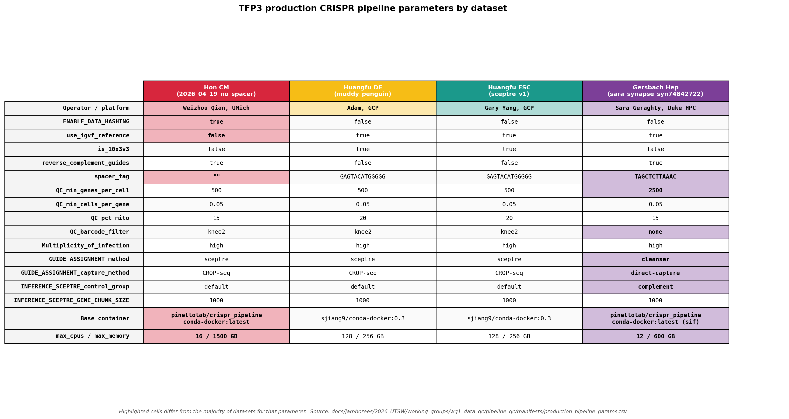

# Pipeline QC — production datasets

Cross-dataset pipeline QC for the five TFP3 production datasets, in preparation for WG1 Figure 1 panels at the [2026 UTSW jamboree](../../../README.md). Mirrors the structure of the technology-benchmark cross-comparison ([docs/manuscripts/CRISPRi_tech_benchmark/bin/2_qc/](../../../../../manuscripts/CRISPRi_tech_benchmark/bin/2_qc/)), applied to differentiated lineages rather than a single WTC11 cell line.

The goal is to harmonize general statistics (cell counts, gRNA/scRNA MOI, %mito) and quality metrics across the five production datasets and to surface a consistent set of comparison panels (gene/guide metrics, intended-target repression, guide capture).

## Datasets

| Dataset ID | Run | Notes |
|---|---|---|
| `Hon_WTC11-cardiomyocyte-differentiation_TF-Perturb-seq` | `2026_04_19_no_spacer` | QC TSVs in `2026_04_19_no_spacer/qc/`; h5mu downloaded from Synapse [`syn74520421`](https://www.synapse.org/Synapse:syn74520421) and lives at `synapse_inference_mudata/inference_mudata.h5mu` (no local CRISPR pipeline run) |
| `Huangfu_HUES8-definitive-endoderm-differentiation_TF-Perturb-seq` | `muddy_penguin` | GCS `2026_04_09/outs/muddy_penguin/` |
| `Huangfu_HUES8-embryonic-stemcell-differentiation_TF-Perturb-seq` | `sceptre_v1` | GCS `2026_04_13/outs/sceptre_v1/` |
| `Gersbach_WTC11-hepatocyte-differentiation_TF-Perturb-seq` | `sara_synapse_syn74842722` | Sara's h5mu from Synapse [`syn74842722`](https://www.synapse.org/Synapse:syn74842722); only QC re-run locally, no full pipeline |
| `Engreitz_WTC11-endothelial-cells_TF-Perturb-seq` | *[FILL IN]* | Not yet onboarded; placeholder card at [data/Engreitz_WTC11-endothelial-cells_TF-Perturb-seq/](../../../data/Engreitz_WTC11-endothelial-cells_TF-Perturb-seq/) |

Per-dataset cards live under [`docs/jamborees/2026_UTSW/data/`](../../../data/).

## Pipeline parameters

The four onboarded datasets were run with three different `(operator, platform, library-chemistry)` combinations. Run-by-run parameter values are recorded in [`manifests/manifest.tsv`](manifests/manifest.tsv); the rendered comparison (lineage-colored headers, outlier cells highlighted) lives at [`results/cross_dataset_metrics/pipeline_params_table.pdf`](results/cross_dataset_metrics/pipeline_params_table.pdf), regenerated by [`scripts/render_params_table.py`](scripts/render_params_table.py).



## Manifest

The combined manifest [`manifests/manifest.tsv`](manifests/manifest.tsv) is the source of truth for everything we know about each of the four onboarded production datasets. One row per dataset, 32 columns, organized into four logical groups:

| Group | Columns |
|---|---|
| Identity | `dataset`, `short_name`, `run` |
| Source / provenance | `params_source`, `params_json`, `dashboard_source_type` (`gcs` \| `synapse`), `dashboard_source_uri`, `dashboard_local` |
| Pipeline params | `ENABLE_DATA_HASHING`, `use_igvf_reference`, `is_10x3v3`, `reverse_complement_guides`, `spacer_tag`, `QC_min_genes_per_cell`, `QC_min_cells_per_gene`, `QC_pct_mito`, `QC_barcode_filter`, `Multiplicity_of_infection`, `GUIDE_ASSIGNMENT_method`, `GUIDE_ASSIGNMENT_capture_method`, `INFERENCE_SCEPTRE_control_group`, `INFERENCE_SCEPTRE_GENE_CHUNK_SIZE`, `base_container`, `max_cpus`, `max_memory_GB` |
| QC output paths | `qc_dir` (absolute), `gene_metrics` / `guide_metrics` / `per_guide_capture` / `intended_target_results` / `intended_target_metrics` (relative to `qc_dir`), `mudata` (absolute) |

Per-dataset QC outputs follow the layout produced by `scripts/qc_array.sh`:

```
datasets/<dataset>/<run>/qc/
  mapping_gene/<short>_gene_metrics.tsv          # per-batch gene-expression QC
  mapping_guide/<short>_guide_metrics.tsv        # per-batch guide-capture QC
  mapping_guide/<short>_per_guide_capture.tsv    # per-guide cells/UMI table
  intended_target/<short>_intended_target_metrics.tsv
  intended_target/<short>_intended_target_results.tsv
```

Every script and notebook below reads directly from `manifest.tsv`; there is no separate per-analysis manifest.

## Scripts

Two utility `.py` scripts under [`scripts/`](scripts/) produce intermediate TSVs and a static figure; the four notebooks at the top of this directory are the analysis flow. Run `.py` from the repo root with `uv run python scripts/<file>.py`; open the notebooks in Jupyter. Suggested order: `upstream_mapping_and_filtering` → `per_dataset_distributions` → `cross_dataset_metrics` → `cross_dataset_distributions`.

| File | What it does | Outputs |
|---|---|---|
| [`scripts/parse_dashboard.py`](scripts/parse_dashboard.py) | Regex-parses each dataset's `dashboard.html` into three tidy TSVs. Source paths come from the manifest's `dashboard_local` column. | `results/upstream_mapping_and_filtering/{per_lane_mapping_summary,filtering_funnel,dataset_summary_metrics}.tsv` |
| [`scripts/render_params_table.py`](scripts/render_params_table.py) | Lineage-colored pipeline-params table (outlier cells highlighted). | `results/cross_dataset_metrics/pipeline_params_table.{pdf,png}` |
| [`upstream_mapping_and_filtering.ipynb`](upstream_mapping_and_filtering.ipynb) | Cell-filtering funnel (linear + log width) and five-panel mapping bars (per-measurement-set and aggregated, for scRNA and Guide), built from the TSVs that `parse_dashboard.py` writes. | `results/upstream_mapping_and_filtering/filtering_flow{,_log}.{pdf,png}`, `…/{per_lane,aggregated}_mapping_{scrna,guide}.{pdf,png}` |
| [`per_dataset_distributions.ipynb`](per_dataset_distributions.ipynb) | Per-dataset cell-level distributions (UMI/gene/mito histograms, guide-capture bins, cells per guide/target). One run per dataset; pick by editing the `SHORT_NAME` cell at the top. | `results/per_dataset_distributions/<SLUG>/` |
| [`cross_dataset_metrics.ipynb`](cross_dataset_metrics.ipynb) | Cross-dataset gene + guide metric bars (n_cells, median UMIs, median genes, median %MT, median sgRNA UMIs, median guides/cell, guide-detection rate, cells/guide, mean assigned guides, singlet fraction), aggregated and per-lane. | `results/cross_dataset_metrics/*.{pdf,png}` |
| [`cross_dataset_distributions.ipynb`](cross_dataset_distributions.ipynb) | Cross-dataset distribution overlays (violins, grouped bars). | `results/cross_dataset_distributions/*.{pdf,png}` |

Dashboards themselves (`dashboard.html` per dataset) are bootstrapped under `scratch/` and pointed to by the manifest's `dashboard_local` column. Re-pull from the source URI in `dashboard_source_uri` if needed.

## Output directory

```
results/
  upstream_mapping_and_filtering/                # TSVs from parse_dashboard.py;
    per_lane_mapping_summary.tsv                 # plots from upstream_mapping_and_filtering.ipynb
    filtering_funnel.tsv
    dataset_summary_metrics.tsv
    filtering_flow{,_log}.{pdf,png}
    per_lane_mapping_{scrna,guide}.{pdf,png}
    aggregated_mapping_{scrna,guide}.{pdf,png}
  per_dataset_distributions/<SLUG>/              # from per_dataset_distributions.ipynb
  cross_dataset_metrics/                         # from cross_dataset_metrics.ipynb
    pipeline_params_table.{pdf,png}              #   + render_params_table.py
    combined_{gene,guide}_metrics.tsv
    {gene,guide,key_combined,metrics_by_lane}_*.{pdf,png}
    metrics_{summary,by_lane}.tsv
  cross_dataset_distributions/                   # from cross_dataset_distributions.ipynb
```
