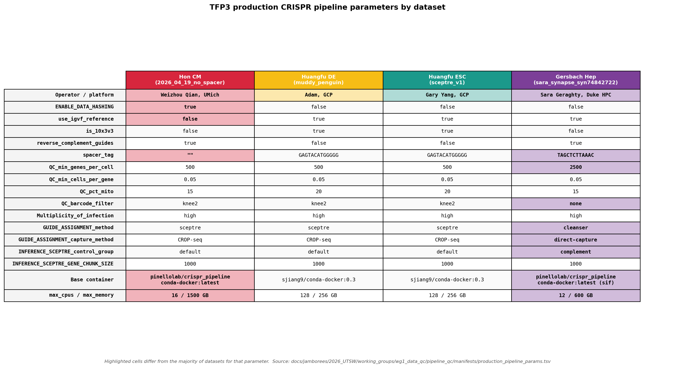

# Pipeline QC — Production Datasets

Cross-dataset pipeline QC for the five TFP3 production datasets, in preparation for WG1 Figure 1 panels at the [2026 UTSW jamboree](../../../README.md). Mirrors the structure of the technology-benchmark cross-comparison ([docs/manuscripts/CRISPRi_tech_benchmark/bin/2_qc/](../../../../../manuscripts/CRISPRi_tech_benchmark/bin/2_qc/)), but applied to differentiated lineages rather than a single WTC11 cell line.

**Goal.** Harmonize general statistics (cell counts, gRNA/scRNA MOI, %mito) and quality metrics across the five production datasets and surface a consistent set of comparison panels (gene/guide metrics, intended-target repression, guide capture) for the jamboree.

## Datasets

| Dataset ID | Canonical run | Notes |
|---|---|---|
| `Hon_WTC11-cardiomyocyte-differentiation_TF-Perturb-seq` | `2026_04_19_no_spacer` | QC TSVs in `2026_04_19_no_spacer/qc/`; h5mu downloaded from Synapse [syn74520421](https://www.synapse.org/Synapse:syn74520421) and lives at `synapse_inference_mudata/inference_mudata.h5mu` (no local CRISPR pipeline run) |
| `Huangfu_HUES8-definitive-endoderm-differentiation_TF-Perturb-seq` | `muddy_penguin` | GCS `2026_04_09/outs/muddy_penguin/` |
| `Huangfu_HUES8-embryonic-stemcell-differentiation_TF-Perturb-seq` | `sceptre_v1` | GCS `2026_04_13/outs/sceptre_v1/` |
| `Gersbach_WTC11-hepatocyte-differentiation_TF-Perturb-seq` | `sara_synapse_syn74842722` | Sara's h5mu from Synapse [syn74842722](https://www.synapse.org/Synapse:syn74842722); only QC re-run locally, no full pipeline |
| `Engreitz_WTC11-endothelial-cells_TF-Perturb-seq` | *TBD* | Not yet onboarded; placeholder card at [data/Engreitz_WTC11-endothelial-cells_TF-Perturb-seq/](../../../data/Engreitz_WTC11-endothelial-cells_TF-Perturb-seq/) |

Per-dataset cards live under [`docs/jamborees/2026_UTSW/data/`](../../../data/).

## Pipeline parameters

The four onboarded datasets were run with three different `(operator, platform, library-chemistry)` combinations. The `params_*.json` for every run has been pulled to the local repo (Synapse for Hon CM and Gersbach Hep; GCS for the two Huangfu runs) and is referenced from [`manifests/production_manifest.tsv`](manifests/production_manifest.tsv) (see [§ Manifest](#manifest) below). A rendered version of the table (lineage-colored headers, outlier cells highlighted) lives at [`results/cross_production_qc/pipeline_params_table.pdf`](results/cross_production_qc/pipeline_params_table.pdf) (regenerate with [`scripts/3_pipeline_params_table.py`](scripts/3_pipeline_params_table.py)).



Differing parameters across runs:

| Param | Hon CM (`2026_04_19_no_spacer`) | Huangfu DE (`muddy_penguin`) | Huangfu ESC (`sceptre_v1`) | Gersbach Hep (`sara_synapse_syn74842722`) |
|---|---|---|---|---|
| Operator / platform | Weizhou Qian, UMich HPC | Adam, GCP Batch | Yan Yang, GCP Batch | Sara Geraghty, Duke HPC |
| `ENABLE_DATA_HASHING` | true | false | false | false |
| `use_igvf_reference` | **false** (custom Gencode v46) | true | true | true |
| `is_10x3v3` | false | **true** | **true** | false |
| `reverse_complement_guides` | true | false | false | true |
| `spacer_tag` | `""` (no spacer) | `GAGTACATGGGGG` | `GAGTACATGGGGG` | `TAGCTCTTAAAC` |
| `QC_min_genes_per_cell` | 500 | 500 | 500 | **2500** |
| `QC_pct_mito` | 15 | 20 | 20 | 15 |
| `QC_barcode_filter` | `knee2` | `knee2` | `knee2` | **`none`** |
| `GUIDE_ASSIGNMENT_method` | sceptre | sceptre | sceptre | **cleanser** |
| `GUIDE_ASSIGNMENT_capture_method` | CROP-seq | CROP-seq | CROP-seq | **direct-capture** |
| `INFERENCE_SCEPTRE_control_group` | default | default | default | complement |
| `INFERENCE_SCEPTRE_GENE_CHUNK_SIZE` | 1000 | 1000 | 1000 | 1000 |
| Base container | `pinellolab/crispr_pipeline/conda-docker:latest` | `sjiang9/conda-docker:0.3` | `sjiang9/conda-docker:0.3` | `pinellolab/crispr_pipeline/conda-docker:latest` (sif) |
| `max_cpus` / `max_memory` | 16 / 1500 GB | 128 / 256 GB | 128 / 256 GB | 12 / 600 GB |

Common across all four runs: `ENABLE_SCRUBLET=false`, `DUAL_GUIDE=false`, `QC_min_cells_per_gene=0.05`, `Multiplicity_of_infection=high`, `INFERENCE_max_target_distance_bp=1000000`, `INFERENCE_SCEPTRE_side=both`, `INFERENCE_SCEPTRE_grna_integration_strategy=union`, `INFERENCE_SCEPTRE_resampling_approximation=skew_normal`, sceptre `sjiang9/sceptre-igvf:0.1`, perturbo `ghcr.io/pinellolab/perturbo:sha-f3dc8ca`, cleanser `gersbachlab-bioinformatics/cleanser:1.2.1`.

## Manifest

A single combined manifest [`manifests/production_manifest.tsv`](manifests/production_manifest.tsv) is the source of truth for everything we know about each of the four onboarded production datasets. One row per dataset, 32 columns, organized into four logical groups:

| Group | Columns |
|---|---|
| **Identity** | `dataset`, `short_name`, `run` |
| **Source / provenance** | `params_source`, `params_json`, `dashboard_source_type` (`gcs` \| `synapse`), `dashboard_source_uri`, `dashboard_local` |
| **Pipeline params** | `ENABLE_DATA_HASHING`, `use_igvf_reference`, `is_10x3v3`, `reverse_complement_guides`, `spacer_tag`, `QC_min_genes_per_cell`, `QC_min_cells_per_gene`, `QC_pct_mito`, `QC_barcode_filter`, `Multiplicity_of_infection`, `GUIDE_ASSIGNMENT_method`, `GUIDE_ASSIGNMENT_capture_method`, `INFERENCE_SCEPTRE_control_group`, `INFERENCE_SCEPTRE_GENE_CHUNK_SIZE`, `base_container`, `max_cpus`, `max_memory_GB` |
| **QC output paths** | `qc_dir` (absolute), `gene_metrics` / `guide_metrics` / `per_guide_capture` / `intended_target_results` / `intended_target_metrics` (relative to `qc_dir`), `mudata` (absolute) |

Per-dataset QC outputs follow the canonical layout produced by `scripts/qc_array.sh`:

```
datasets/<dataset>/<run>/qc/
  mapping_gene/<short>_gene_metrics.tsv          # per-batch gene-expression QC
  mapping_guide/<short>_guide_metrics.tsv        # per-batch guide-capture QC
  mapping_guide/<short>_per_guide_capture.tsv    # per-guide cells/UMI table
  intended_target/<short>_intended_target_metrics.tsv
  intended_target/<short>_intended_target_results.tsv
```

All scripts and notebooks below read directly from `production_manifest.tsv` — there is no separate per-analysis manifest.

## Scripts

Outputs land in `results/cross_production_qc/` (or `…/upstream/` for the kallisto-level mapping figures below). Run from the repo root with `uv run python …` (or open the notebooks in Jupyter).

### Upstream pipeline QC (0-series, ported from [`docs/manuscripts/CRISPRi_tech_benchmark`](../../../../../manuscripts/CRISPRi_tech_benchmark))

Mapping / barcode-filtering QC from each run's `pipeline_dashboard/dashboard.html`. Source dashboards stay on GCS / Synapse; one local copy is held under `scratch/2026_05_14/upstream_qc/data/` (paths in the manifest's `dashboard_local` column).

| Script | What it does | Outputs (under `results/cross_production_qc/upstream/`) |
|---|---|---|
| [`scripts/0a_sync_upstream_dashboards.py`](scripts/0a_sync_upstream_dashboards.py) | `gsutil cp` / `synapseclient get` each `dashboard.html` to its `dashboard_local` path. Idempotent (`--force` to re-pull). | — |
| [`scripts/0b_build_upstream_tables.py`](scripts/0b_build_upstream_tables.py) | Regex-parses each dashboard.html into 3 tidy TSVs. | `per_lane_mapping_summary.tsv`, `filtering_funnel.tsv`, `dataset_summary_metrics.tsv` |
| [`scripts/0c_plot_filtering_flow.py`](scripts/0c_plot_filtering_flow.py) | Cell-filtering funnel per dataset (linear + log width). | `filtering_flow.{pdf,png}`, `filtering_flow_log.{pdf,png}` |
| [`scripts/0d_plot_per_lane_mapping.py`](scripts/0d_plot_per_lane_mapping.py) | 5-panel mapping bars (Total Reads / Mapped Reads / Alignment % / Detected Barcodes / % Reads in Onlist), per measurement set AND aggregated across lanes, for scRNA and Guide. | `per_lane_mapping_{scrna,guide}.{pdf,png}`, `aggregated_mapping_{scrna,guide}.{pdf,png}` |

### Downstream metrics (1/2/3-series)

| Script | What it does | Outputs |
|---|---|---|
| [`scripts/1_metrics_comparison.ipynb`](scripts/1_metrics_comparison.ipynb) | Cross-dataset gene + guide metric bars (n_cells, median UMIs, median genes, median %MT, median sgRNA UMIs, median guides/cell, guide-detection rate, cells/guide, mean assigned guides, singlet fraction) — aggregated and per-lane. | `results/cross_production_qc/*.{pdf,png}` |
| [`scripts/2_distributions_*_lite.ipynb`](scripts/) | Per-dataset distribution QC (UMI/gene/mito knee plots, guide capture histograms). One notebook per dataset. | `results/per_dataset_distributions/<short>/` |
| [`scripts/3_distributions_cross_dataset.ipynb`](scripts/3_distributions_cross_dataset.ipynb) | Cross-dataset distribution overlays. | `results/cross_production_qc/*.{pdf,png}` |
| [`scripts/3_pipeline_params_table.py`](scripts/3_pipeline_params_table.py) | Lineage-colored params table (outlier cells highlighted). | `results/cross_production_qc/pipeline_params_table.{pdf,png}` |

## Output directory

```
results/
  cross_production_qc/
    pipeline_params_table.{pdf,png}          # from 3_pipeline_params_table.py
    upstream/                                # from 0a–0d
      per_lane_mapping_summary.tsv
      filtering_funnel.tsv
      dataset_summary_metrics.tsv
      filtering_flow{,_log}.{pdf,png}
      per_lane_mapping_{scrna,guide}.{pdf,png}
      aggregated_mapping_{scrna,guide}.{pdf,png}
    (downstream comparison figures land here too)
  per_dataset_distributions/<short>/         # from 2_distributions_*_lite.ipynb
```

## Color scheme

Lineage-themed palette in [config/colors/production_TF-Perturb-seq.yaml](../../../../../../config/colors/production_TF-Perturb-seq.yaml):

| Dataset | Lineage cue | Hex |
|---|---|---|
| Hon_WTC11-cardiomyocyte-differentiation_TF-Perturb-seq | cardiac red | `#D7263D` |
| Huangfu_HUES8-definitive-endoderm-differentiation_TF-Perturb-seq | endoderm gold | `#F6BD16` |
| Huangfu_HUES8-embryonic-stemcell-differentiation_TF-Perturb-seq | stem-cell teal | `#1B998B` |
| Gersbach_WTC11-hepatocyte-differentiation_TF-Perturb-seq | royal purple | `#7C3F98` |
| Engreitz_WTC11-endothelial-cells_TF-Perturb-seq | vascular pink | `#E36A9E` |

Load via the existing config loader ([config/loader.py](../../../../../../config/loader.py)):

```python
from tf_perturb_seq.config.loader import load_colors
colors = load_colors("production_TF-Perturb-seq", "dataset_colors")
order  = load_colors("production_TF-Perturb-seq", "dataset_order")
```

## Status / outstanding work

- **Engreitz endothelial** is not yet onboarded — no `datasets/Engreitz_WTC11-endothelial-cells_TF-Perturb-seq/` directory exists. Scripts skip it gracefully until it lands.
- **Gersbach hepatocyte** only has QC re-run locally over Sara's h5mu; there is no full local CRISPR pipeline run, and `per_guide_capture.tsv` may be absent — confirm before running the cross-dataset distribution notebook. The upstream pipeline (0a–0d) does work for Gersbach Hep because we pull `dashboard.html` directly from Sara's Synapse upload.
- **`dataset_summary_metrics.tsv`** uses the dashboard's rounded top-line `n_cells` (e.g. `1M`, not 1,053,820). Good enough for the upstream figures; use `gene_metrics.tsv` if you need exact final cell counts.

## Synapse outputs

Final figures and combined tables should be mirrored to WG1's Synapse folder [`syn74954079`](https://www.synapse.org/Synapse:syn74954079) under `working_groups/wg1_data_qc/pipeline_qc/`, per the [WG1 README](../README.md) sharing flow.
