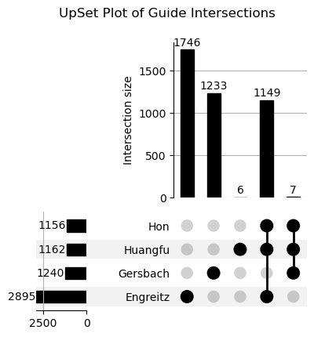

# Files provided by labs
`Hon_sgRNA_index_dacc_annot_reference.csv` -- 14,358 total guides, latest file from Hon lab

`Huangfu_ref_feature.csv` -- 14,364 total guides, latest file from Huangfu lab

`Gersbach_feature_ref_5.csv` -- 17,034 total guides, latest file from Gersbach lab (includes Pool F)

`Engreitz_eTN7_guides_filtered.csv` -- 17,017 total guides, latest file from Engreitz lab (includes some of Pool F)

UpSet plot of mismatching sgRNA sequences:

# Files extracted from [here](https://docs.google.com/spreadsheets/d/1WcVgLllWrtO_-h5Ry07WS_ovomRcyznQdZrx2KOntEU/edit?gid=1430289032#gid=1430289032)
`negative_controls.tsv` (Neg control sgRNAs (targeting) sheet) -- 600 targeting guides, 100 targets, 6 guides per target

`non_targeting.tsv` (Neg control sgRNAs (non-targeting) sheet) -- 600 non-targeting guides

`positive_controls.tsv` (Pos control sgRNAs sheet) -- 19 targeting guides, 19 targets, 1 guide per target

`target_genes.tsv` (Target genes + sgRNAs (with alt prom) sheet) -- 13,260 targeting guides, 1983 targets (some with multiple promoters), 6 guides per target

# Master generated from merging files (Adam)
`sgRNA_id_master.tsv` -- 14,364 total guides, merged guides from Hon and Huangfu labs (see `guide_mapping.ipynb`)

# Harmonized files generated across all 4 labs, in finalized_annotation_files directory (Sara)
See `explore_sgRNA_annot.ipynb` for exploration of guide intersections with reference, `create_harmonized_sgRNA_annot.ipynb` for creation of harmonized guide files.

`harmonized_guide_file_poolabcd.csv` -- sgRNAs from Pools A-D, using only 1 version of each sgRNA (from reference)

`harmonized_guide_file_poolf.csv` -- sgRNAs from Pool F

`harmonized_guide_file_poolabcd_inclMismatches.csv` -- sgRNAs from Pools A-D, including multiple copies of certain guides for which sgRNA sequences do not match between labs (some fields for mismatches that deviate from the reference will be empty)

